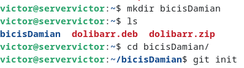
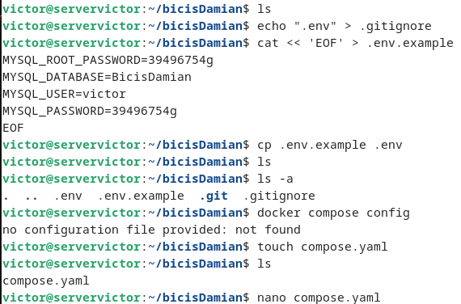
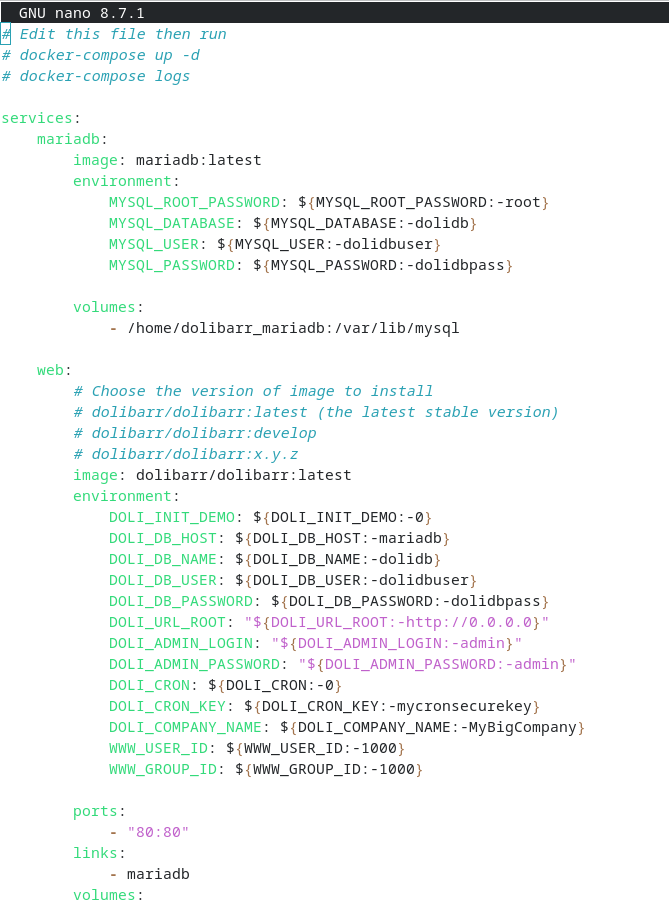

# Tarea-06-SXE-BICIS-DAMIAN
- En el ubuntu server primero crear la carpeta "bicisDamian" en la que hay que crear un repositorio con git init para poner el compose.yaml
> 
- Despues meter el ".env" dentro de gitignore como pide la tarea y poner las contraseñas y nombre de usuario
> 
- Dentro del nano del compose.yaml poner el siguiente codigo que saque de https://hub.docker.com/r/dolibarr/dolibarr 
> 
